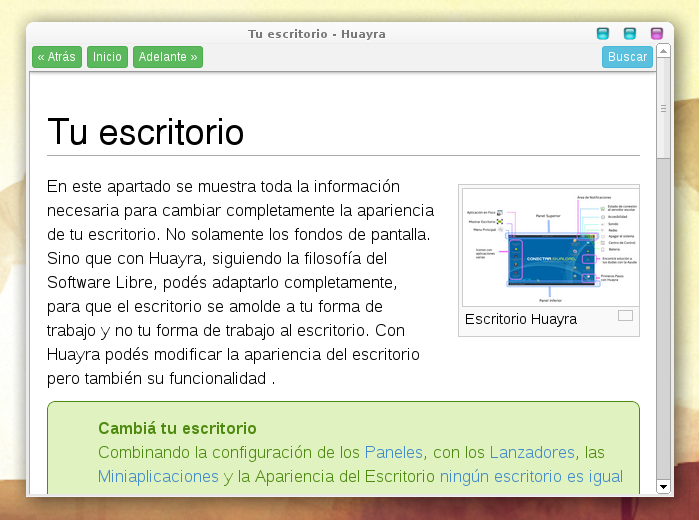
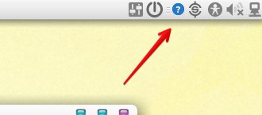

huayra-visor-manual
===================

El visor de manual de Huayra es una aplicación que muestra toda
la documentación de referencia del sistema operativo y las aplicaciones
inluidas:

Instalación
-----------

Primero tienes que tener instalado nodewebkit, por ejemplo instando el
paquete .deb que incluye huayralinux.

Luego tienes que clonar este repositorio y ejecutar estos comandos:

    cd visormanual-bitbucket
    nw src

La aplicación tiene que aparecer en la barra de notificación del sistema:

